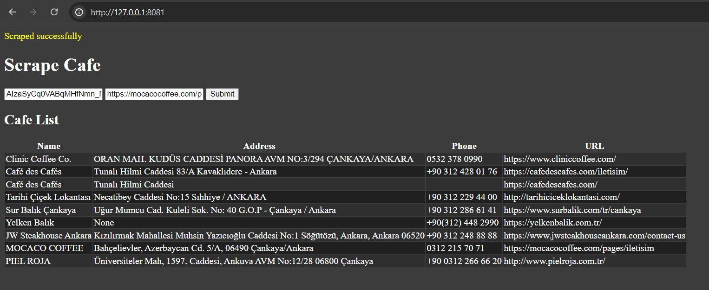

# A Flask web app to demonstrate AI assisted web scraping 

In this quick project Gemini API is used to scrape cafe information like name, address, phone.
As an input you need to provide your gemini api key and the url of the cafe you want to scrape.
When you submit it gets the content of the url and sends it to gemini to extract the desired information.

This project also is developed on https://idx.google.com/ to experience an AI-assisted development platform in the cloud which is nix based.

For Flask refer to: https://flask.palletsprojects.com

For Gemini create your free API key: https://ai.google.dev/gemini-api

## Further Steps

Sometimes scraped data may be incorrect or missing, therefore you can add ability for your users to edit and update it.

## Creating the Database in your environment

To set up the database, use the following default connection parameters:

- **Username:** user
- **Password:** user
- **Database name:** user

Follow these steps to create the database in your environment:
1. Create the database with the specified owner and encoding:

`CREATE DATABASE "user" WITH OWNER "user" ENCODING 'UTF8';`

2. Set the password for the user:

`ALTER USER "user" WITH PASSWORD 'user';`

3. Run the **create.sql** script included in the project.

## Screenshots

